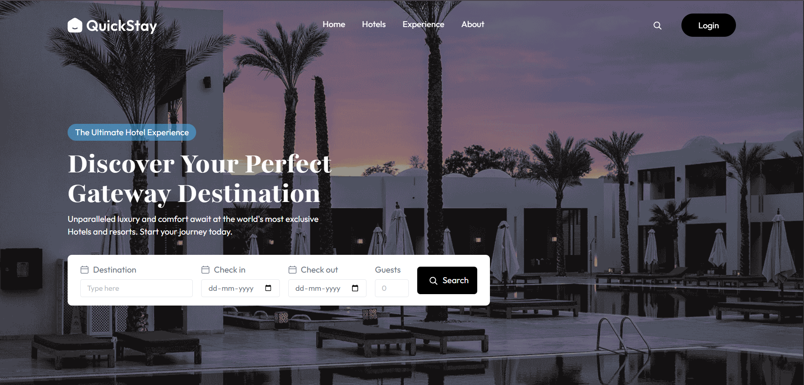
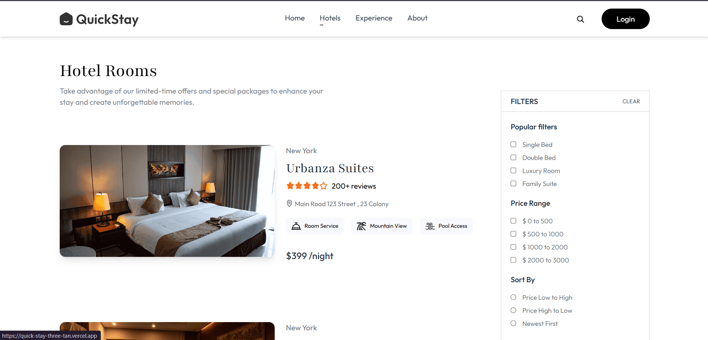
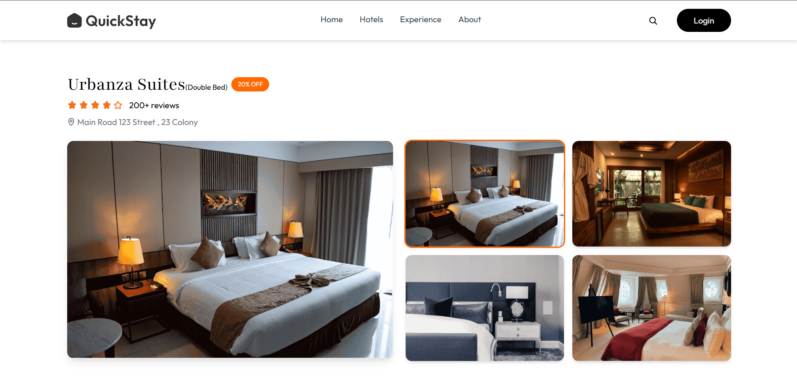

# 🏨 QuickStay – Hotel Booking Platform

QuickStay is a full-stack hotel booking web application that allows users to browse, register, and manage hotels seamlessly. It includes secure authentication, cloud-based image uploads, and owner-specific dashboards.

---

## 🚀 Features

### 🔐 Authentication (Clerk)
- Secure login and signup
- Custom JWT token validation
- Protected routes for hotel owners

### 🏨 Hotel Management
- Add hotels with multiple images
- View and manage owned hotels
- Owner dashboard

### ☁️ Cloud Storage (Cloudinary)
- Upload and store hotel images
- Automatic optimization

### 🗄️ Backend API (Express + MongoDB)
- REST APIs
- Secure middleware
- MongoDB Atlas for data storage

### 🎨 Frontend (React + Vite)
- Modern UI
- Fast rendering
- API integration with backend

---

## 🛠️ Tech Stack

### **Frontend**
- React
- Vite
- Axios
- Clerk Authentication
- Vercel Deployment

### **Backend**
- Node.js
- Express
- MongoDB / Mongoose
- Cloudinary
- Render Deployment

---

## 🌐 Deployment Links

- Live deployment link: https://quick-stay-three-tan.vercel.app/

---

## 🔧 Installation

### 1️⃣ Clone the repository
git clone https://github.com/Ridhi247/QuickStay
cd QuickStay

### 2️⃣ Install frontend dependencies
cd client
npm install

### 3️⃣ Install backend dependencies
cd ../server
npm install

---

## ▶️ Run Locally

## Backend
cd server
npm start

## Frontend
cd client
npm run dev

---

## 🧠 Challenges Faced
- Integrating Clerk authentication with backend
- Setting up environment variables on Vercel and Render
- Solving CORS issues between frontend and backend
- Handling Cloudinary multi-image uploads
- Fixing GitHub and Vercel deployment configuration issues

---

## 📚 Learnings

- Full-stack deployment workflow
- Token-based authentication
- Cloudinary image handling
- Environment variable security
- Debugging real API issues

---

## 🤝 Contributing
Contributions and suggestions are welcome.

---

## 📸 Screenshots

### 🏠 Home Page

### 🏨 Hotel Listings

### 🛏️ Hotel Details Page

### 📅 Booking Section

